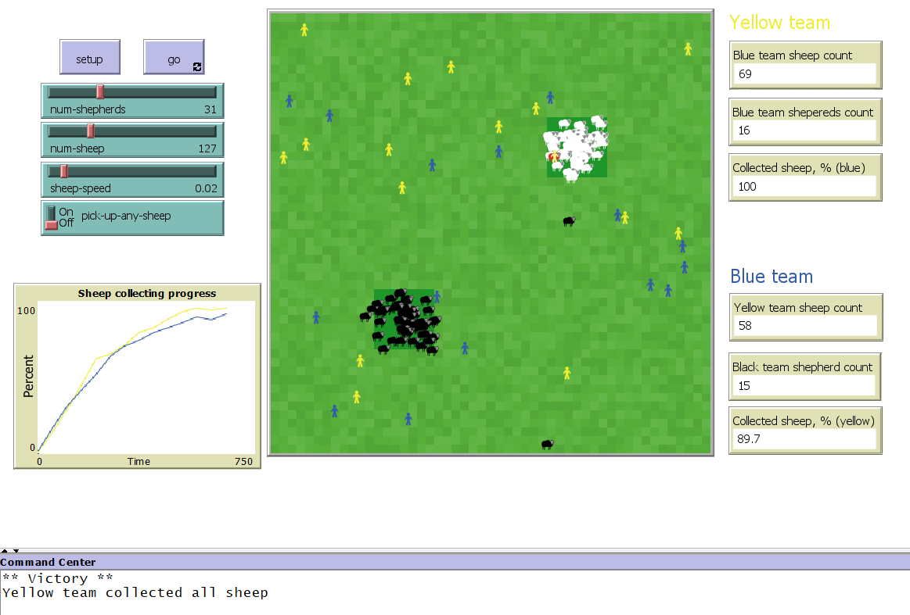
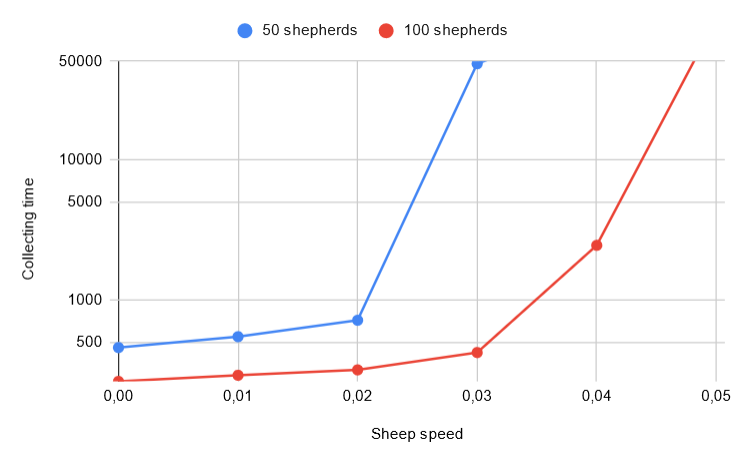

## Комп'ютерні системи імітаційного моделювання
## СПм-23-4, **Кириленко Дмитро Володимирович**
### Лабораторна робота №**2**. Редагування імітаційних моделей у середовищі NetLogo

 

### Варіант 9, модель у середовищі NetLogo:
[Shepherds](http://www.netlogoweb.org/launch#http://www.netlogoweb.org/assets/modelslib/Sample%20Models/Biology/Shepherds.nlogo)

### Внесені зміни у вихідну логіку моделі, за варіантом:

**Поділити овець та пастухів на дві організації** Пастухи повинні збирати тільки "своїх" овець.

Поділ виконується додаванням вівцям і пастухам власного параметра *team-color*

<pre>
sheep-own 
[
  team-color                   ;; indicates which team the sheep belongs to
]
shepherds-own
[
  carried-sheep                ;; the sheep the shepherd is carrying ('nobody' if he is carrying nothing)
  team-color                   ;; indicates which team the shepherd belongs to
]
</pre>

Ми створюємо глобальні змінні, в яких зберігається колір кожної команди, щоб забезпечити легкість зміни цього кольору на будь-який інший (у моєму випадку обрані кольори *Yellow* та *Blue*).

<pre>
globals
[
  first-team-color
  second-team-color
  ...
]

to setup
  clear-all
  set-default-shape sheep "sheep"
  set-default-shape shepherds "person"
  
  set first-team-color yellow                                     ;; set first team color
  set second-team-color blue                                      ;; set second team color

  ...

  create-sheep num-sheep
  [ 
    set team-color get-team-color                  ;; random set a team for a sheep
    set color get-sheep-color team-color           ;; according to team set sheep color
    set size 1.5                                   ;; easier to see
    setxy random-xcor random-ycor
  ]
  create-shepherds num-shepherds
  [ 
    set team-color get-team-color                 ;; random set a team for a shepherd
    set color team-color                          ;; according to team set shepherd color
    set size 1.5                                  ;; easier to see
    set carried-sheep nobody
    setxy random-xcor random-ycor
  ]

  reset-ticks
end
</pre>

Функція *get-team-color* генерує випадковий колір для команди, що призводить до того, що випас вівці і розташування пастухів не завжди рівномірно розподілені.

<pre>
to-report get-team-color                          ;; random return team color
  ifelse (random 2 > 0)
  [ report first-team-color ]
  [ report second-team-color ]
end
</pre>

**Додати відключаєму можливість збирати "чужих" овець**, які після потрапляння до нового стада змінюють свою приналежність:

Залежно від значення перемикача на головному екрані моделювання, змінна *pick-up-any-sheep* визначає, чи можуть пастухи підбирати вівці як зі свого стада, так і з чужого стада. Якщо значення *pick-up-any-sheep* дорівнює true, то пастухи підбирають овець з обох стад. У такому випадку, коли пастух підбирає "чужу" вівцю, значення властивості *team-color* у цій вівці оновлюється на відповідне значення команди пастуха, який її підбрав.

<pre>
to search-for-sheep                               ;; shepherds procedure of sheep searching
  ...
  set carried-sheep one-of sheep-here with [ 
    color != red                                  ;; a sheep is not carried by someone else
    and (pick-up-any-sheep                        ;; it's allowed to take any sheep
  ...

  if (carried-sheep != nobody)
    [ ask carried-sheep
      [ 
        set color red                             ;; it makes the sheep unavailable to other shepherds while carrying
        set team-color shepherd-team-color        ;; to appropriate the sheep (for case when shepherd took someone else's sheep)
      ]
      set color team-color + 2                    ;; it indicateds that shepherd is bussy while carrying a sheep
      fd 1 ]
end
</pre>

Також, коли пастух переносить вівцю до власного пасовища, замість того, щоб зникати, вівці змінюють свій колір на *червоний*. Це зроблено для того, щоб наочно видно було пастуха, який переносить вівцю.

 

### Внесені зміни у вихідну логіку моделі, на власний розсуд:

**Додано забарвлення вівці**  в залежності від кольру команди в якій вона наразі рахується.
<pre>
to-report get-sheep-color [colour]               ;; accordig to team color paint sheep
  ifelse (colour = first-team-color)
  [ report white ]
  [ report black]
end
</pre>

**Додано фіксовані координати пасовища кожної команди**
Пастухи мають висаджувати овець тільки на території свого пасовища. В моємі прикладі центр пасовища першої команди знаходиться в точці (10; 10), другої (-10; -10)
<pre>
to-report get-pasture-cor [colour]                ;; accordig to team color return coordinates of pasture location
  ifelse (colour = first-team-color)
  [ report 10 ]
  [ report -10 ]
end
</pre>

Залежно від загальної кількості вівцей, що може бути динамічно задана, розмір пасовища змінюється. Територія пасовища поділяється на дві частини: загальну територію та зону висадки вівцей, яка знаходиться в центрі і особливим чином позначена кольором, що відповідає кожній з команд.

Всі *patches* маю властивості:
 *patch-team-color* зберігає колір команди якій належать або *nobody* якщо нікому не належить; *is-drop-off-area* взазує на те чи це місце для висадки овець
<pre>
globals
[
  ...
  drop-off-area-radius         ;; area where shepherds have to drop off sheep
  safe-pasture-area-radius     ;; area around drop off zone where sheep can move and shepereds don't pick up them
]
patches-own
[
  patch-team-color             ;; what team the patch belongs to ('nobody' if the patch belongs to nobody)
  is-drop-off-area             ;; let shepherd to drop-off a sheep here
]

...

to setup
  ...

  set safe-pasture-area-radius ceiling ((sqrt num-sheep) / 4)
  set drop-off-area-radius ceiling (safe-pasture-area-radius / 4)

  ask patches
  [
    set pcolor green + (random-float 0.8) - 0.4    ;; varying the green just makes it look nicer
    set patch-team-color nobody                    ;; all patches belong to nobody in the begining
    set is-drop-off-area false                     ;; there are no drop off areas in the begining
    setup-pasture-area first-team-color            ;; setup pasture area for first team
    setup-pasture-area second-team-color           ;; setup pasture area for second team
  ]

  ...
end

...

to setup-pasture-area [ color-of-team ]
  let pasture-cor get-pasture-cor color-of-team
  
  if pxcor >= pasture-cor - safe-pasture-area-radius and pxcor <= pasture-cor + safe-pasture-area-radius and pycor >= pasture-cor - safe-pasture-area-radius and pycor <= pasture-cor + safe-pasture-area-radius
  [ 
    set pcolor 63.5                               ;; paint pasture area
    set patch-team-color color-of-team            ;; mark that patches belong to a team
  ]

  if (pxcor > pasture-cor - drop-off-area-radius and pxcor < pasture-cor + drop-off-area-radius
      and pycor > pasture-cor - drop-off-area-radius and pycor < pasture-cor + drop-off-area-radius)
  [ 
    set is-drop-off-area true                     ;; mark dropping off area
    set pcolor color-of-team                      ;; paint drop off area in team color
  ]
end
</pre>

**Коли пастух підібрав вівцю, він рухається чітко по направлені до свого пасовища**, Замість хаотичного руху під час пошуку вівці, пастухи висаджують вівцю лише на своєму пасовищі і тільки в зоні призначеній для висадки вівцей. Після висадки, вівця фарбується в колір, відповідний команді цієї вівці.

На території свого пасовища пастух не підбирає "своїх" овець, але може підбирати "чужих" овець, якщо змінна *pick-up-any-sheep* має значення *true*.

<pre>
to search-for-sheep                               ;; shepherds procedure of sheep searching
  let shepherd-team-color team-color
  set carried-sheep one-of sheep-here with [ 
    color != red                                  ;; a sheep is not carried by someone else
    and (pick-up-any-sheep                        ;; it's allowed to take any sheep
      or team-color = shepherd-team-color)        ;; a sheep team and a shepered team are the same
    and (patch-team-color = nobody                ;; a sheep is located away from the pasture
      or patch-team-color != shepherd-team-color  ;; a sheep is located in someone else's pasture
      or team-color != shepherd-team-color) ]     ;; a sheep team and a shepherd team are different (condition reachable when 'pick-up-any-sheep' is ON and a sheep from someone else's pasture on shepherd's pasture area)
  
  if (carried-sheep != nobody)
    [ ask carried-sheep
      [ 
        set color red                             ;; it makes the sheep unavailable to other shepherds while carrying
        set team-color shepherd-team-color        ;; to appropriate the sheep (for case when shepherd took someone else's sheep)
      ]
      set color team-color + 2                    ;; it indicateds that shepherd is bussy while carrying a sheep
      fd 1 ]
end

to find-empty-spot                                ;; looking for its own pasture and area on it to drop off a sheep
  if (patch-team-color = team-color and is-drop-off-area)
  [   
    ask carried-sheep
    [ set color get-sheep-color team-color ]      ;; make the sheep accessible again
    set color team-color                          ;; make the shepherd free
    set carried-sheep nobody                      ;; make the shepherd free
  ]
  set-pasture-direction
end

to set-pasture-direction                          ;; set heading of moving to team drop off area for sheperd when he is carrying a sheep
  let pasture-cor get-pasture-cor team-color
  set heading ((atan (pasture-cor - xcor) (pasture-cor - ycor) ))
end
</pre>

**Зупинка симуляції, якщо будь-яка із команд зібрала всіх "своїх" овець**

Розраховується відсоток зібраних овець (зібраною вважається вівця, яка знаходиться на території свого пасовища), і якщо цей відсоток перевищує 99%, то команда яка перша зробила це, оголошується переможцем [ в консолі друкується колір команди яка перемогла].
<pre>
to go
  ifelse is-game-over
  [ stop ]                                        ;; stop simulation if any team collected all their sheep
  [ tick ]
  
  ...
end

...

to-report is-game-over                            ;; returns boolean is any of team collected more than 99% of all their sheep
  let first-team-progress calculate-team-progress first-team-color
  let second-team-progress calculate-team-progress second-team-color
  if first-team-progress < 99 and second-team-progress < 99
  [ report false ]
  
  let winner-color "Yellow"                       ;; first-team-color
  if  second-team-progress > first-team-progress
  [ set winner-color "Blue" ]                     ;; second-team-color
  
  print "** Victory **"                           ;; prints which team won
  print word winner-color " team collected all sheep"
  print word "Simulation finished at tick " ticks
  report true
end

...

to-report calculate-team-progress [ colour ]    ;; calculate how many sheep are already collected
  let collected-sheep count sheep with [ patch-team-color = team-color and team-color = colour ] ;; sheep that are already on home pasture
  let all-sheep count sheep with [ team-color = colour ] + 0.001                                 ;; all sheep of this team P.S. + 0.001 is a workaround to avoid division by zero
  report (collected-sheep / all-sheep) * 100
end
</pre>

**Монітори виводу**
Монітор з графіками показує прогрес кожної команди в графічному вигляді.

Також додано звичайні монітори, які показують кількість пастухів та овець кожної із команд, а також відсоток зібраних овець.

 

## Обчислювальні експерименти

### 1. Вплив швикості овець на час їх збирання
Досліджується залежність часу збирання овець від  швидкості їх пересування.
Експерименти проводяться при швидкостях 0-0.05 у.о. з кроком 0.01 , усього 5 симуляцій.  
Інші керуючі параметри мають значення за замовчуванням:
- **num-shepherds 1**: 50
- **num-shepherds 2**: 100
- **num-sheep**: 250

<table>
<thead>
<tr><th>Sheep speed</th><th>Collecting time, [50 sh]</th><th>Collecting time, [100 sh]</th></tr>
</thead>
<tbody>
<tr><td>0</td><td>461</td><td>265</td></tr>
<tr><td>0.01</td><td>551</td><td>293</td></tr>
<tr><td>0.02</td><td>655</td><td>320</td></tr>
<tr><td>0.03</td><td>48 072</td><td>425</td></tr>
<tr><td>0.04</td><td>endless</td><td>2458</td></tr>
<tr><td>0.05</td><td>endless</td><td>endless</td></tr>
</tbody>
</table>

Графік ілюструє, що зі збільшенням швидкості руху вівцей, збільшується час, необхідний для їх збирання до пасовища. При досягненні швидкості вівцей понад 0.04 у.о., час нескінченно зростає. Навіть збільшення кількості пастухів вдвічі не має суттєвого впливу на час.