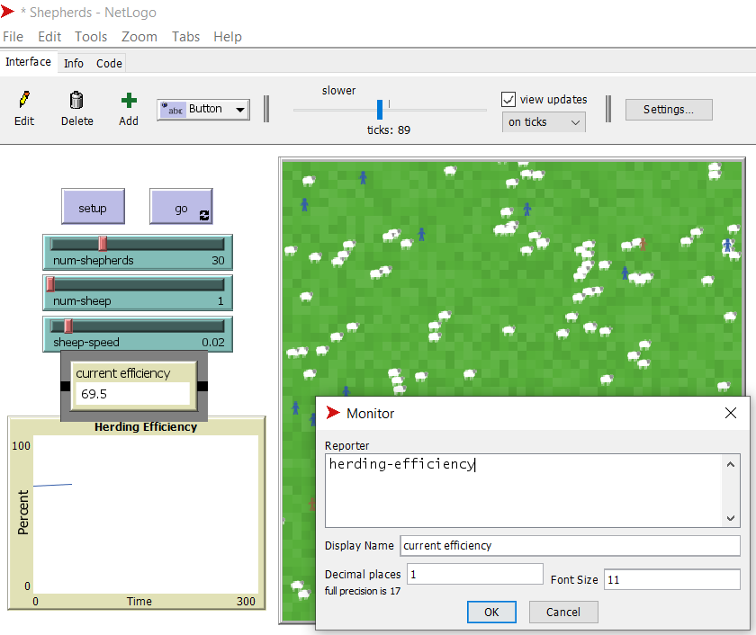
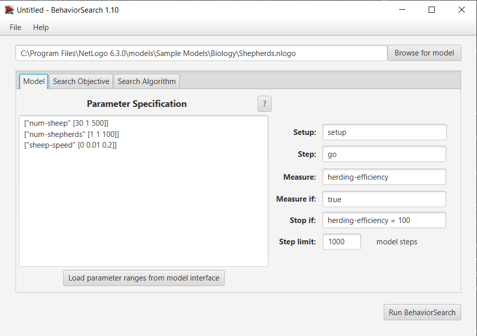
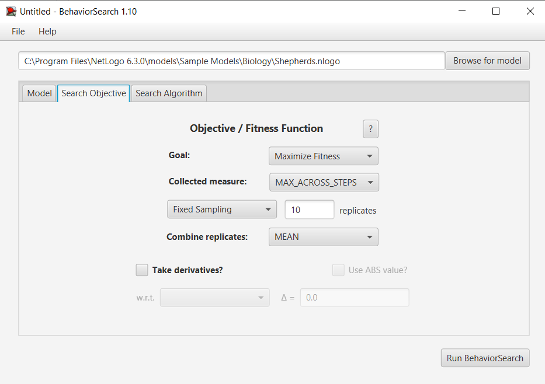
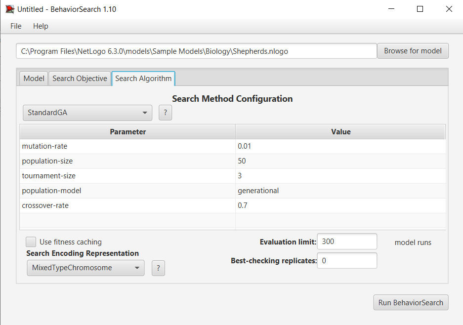
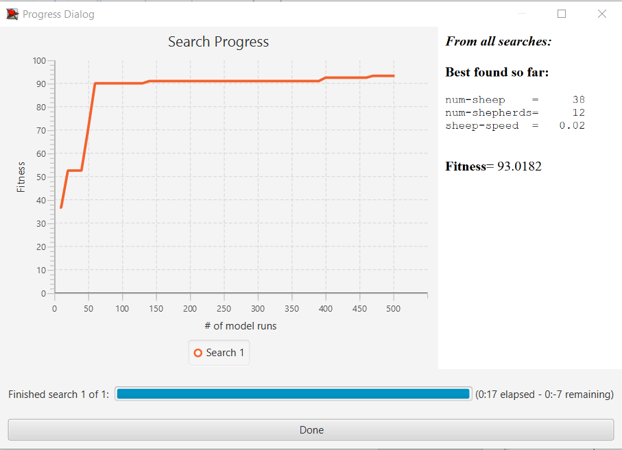
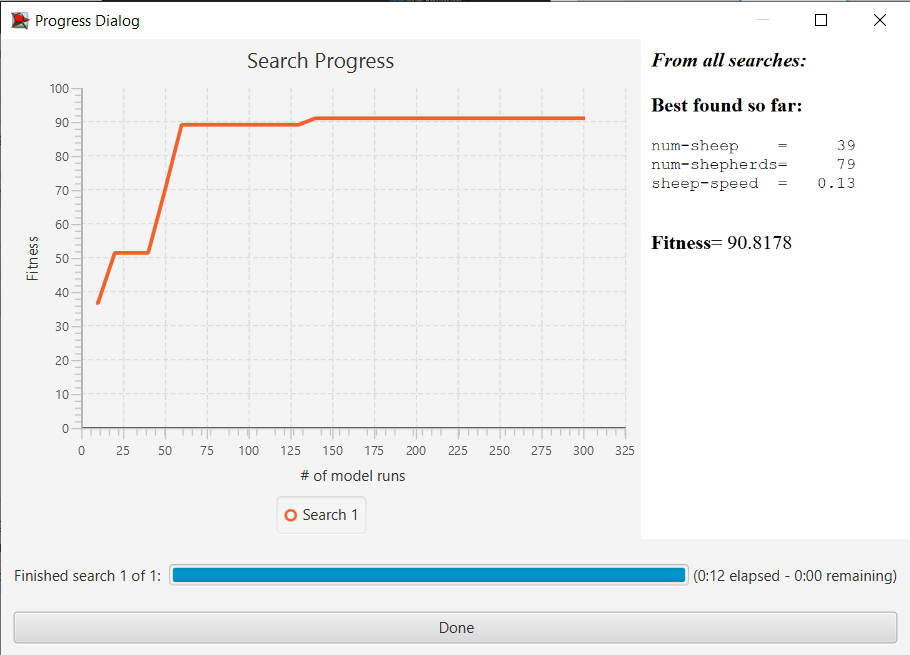

## Комп'ютерні системи імітаційного моделювання
## СПм-23-4, **Кириленко Дмитро Володимирович**
### Лабораторна робота №**3**. Використання засобів обчислювального интелекту для оптимізації імітаційних моделей

 

### Варіант 9, модель у середовищі NetLogo:
[Shepherds](http://www.netlogoweb.org/launch#http://www.netlogoweb.org/assets/modelslib/Sample%20Models/Biology/Shepherds.nlogo)

 

### Вербальний опис моделі:
Можливість зібрати вівцей в одну отару у цій симуляції залежить від кількості пастухів і швидкості їх руху в порівнянні з вівцями, які блукають безладно.

### Керуючі параметри:
- **num-shepherds** визначає загальну кількість пастухів на пасовищі.
- **num-sheep** визначає загальну кількість вівців на пасовищі.
- **sheep-speed** визначає швидкість руху вівці на кожному ігровому такті за умови, що її не переносить пастух.

### Внутрішні параметри:
- **sheepless-neighborhoods** показує скільки ділянок не мають овець на сусідніх ділянках.
- **herding-efficiency** вимірює, наскільки добре випасають овець.

### Показники роботи системи:
- на кожному такті симуляції вимірюється ефективність випасу вівцей. Ця ефективність визначається кількістю ділянок, які не мають вівцей у своєму оточенні. Чим більше вівцярі пасуть вівцей, тим більше ділянок повинно бути порожніми, що свідчить про вищу ефективність випасу.

 

### Налаштування середовища BehaviorSearch:

**Обрана модель**:
<pre>
C:\Program Files\NetLogo 6.3.0\models\Sample Models\Biology\Shepherds.nlogo
</pre>
**Параметри моделі** (вкладка Model):  
Параметри та їх модливі діапазони були **автоматично** вилучені середовищем BehaviorSearch із вибраної імітаційної моделі:
<pre>
["num-sheep" [30 1 500]]
["num-shepherds" [1 1 100]]
["sheep-speed" [0 0.01 0.2]]
</pre>

Я вніс зміни до початкової кількості овець, порівняно зі значенням за замовчуванням, для забезпечення коректності симуляції. Це було необхідно, оскільки BehaviorSearch запропонував найкраще рішення при кількості овець, рівній нулю, що не відповідає реальному контексту симуляції.

Використовувана **міра**:  
Для фітнес-функції було обрано **значення ефективності випасання овець**, її значення для розрахунку взято з монітору, що представлений в імітаційной моделі в середовищі NetLogo  
  
та вказано у параметрі "**Measure**":
<pre>
herding-efficiency
</pre>

Значення ефективності випасання овець повинно братися **максимальне** за весь період симуляції тривалістю, 1000 тактів (адже на кожному такті є своє значення ефективності випасання), починаючи з 0 такту симуляції.  
 
Параметр зупинки за умовою ("**Stop if**") досягнення максимально можливої ефективності
<pre>
herding-efficiency = 100
</pre>
Загальний вигляд вкладки налаштувань параметрів моделі:  

**Налаштування цільової функції** (вкладка Search Objective):  
Метою підбору параметрів імітаційної моделі, що описує ефективність випасу овець, є досягнення максимального значення ефективності. Це досягається шляхом налаштування параметрів моделі таким чином, щоб максимізувати значення ефективності. Ціль такого підбору вказана через параметр **Goal**, який встановлений на значення **Maximize Fitness**. Отже, метою є визначення параметрів, при яких ефективність випасу буде максимальною в певний момент симуляції. Середнє значення ефективності за всю тривалість симуляції (що складає 1000 кроків) не є цікавим. Для цього, в параметрі **Collected measure**, який визначає спосіб обліку значень обраного показника, встановлено значення **MAX_ACROSS_STEPS**. Це забезпечує обрахунок максимального значення ефективності у окремі моменти симуляції. Щоб уникнути спотворення результатів через випадковість, що властива логіці самої моделі, кожна симуляція повторюється 10 разів. Результат обчислюється як середнє арифметичне цих 10 повторних симуляцій.

Загальний вигляд вкладки налаштувань цільової функції:  

**Налаштування алгоритму пошуку** (вкладка Search Algorithm):  

У ході дослідження на лабораторній роботі використовуються два алгоритми: випадковий пошук(**RandomSearch**) і простий генетичний алгоритм (**StandardGA**).  

Загальний вид вкладки налаштувань алгоритму пошуку:  

 

### Результати використання BehaviorSearch:
Результат пошуку параметрів імітаційної моделі, використовуючи **генетичний алгоритм**:

Результат пошуку параметрів імітаційної моделі, використовуючи **випадковий пошук**:  
